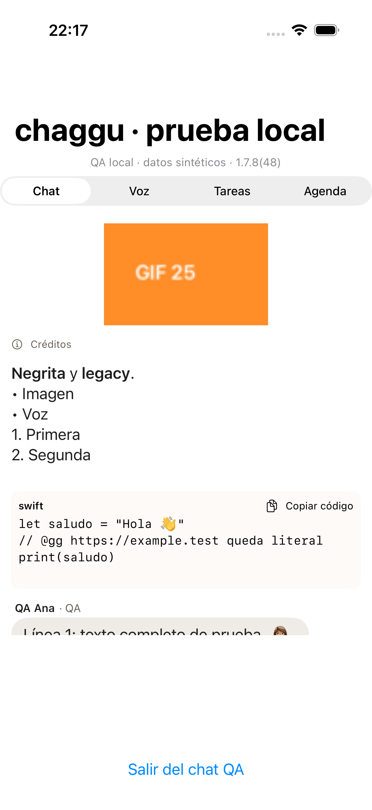
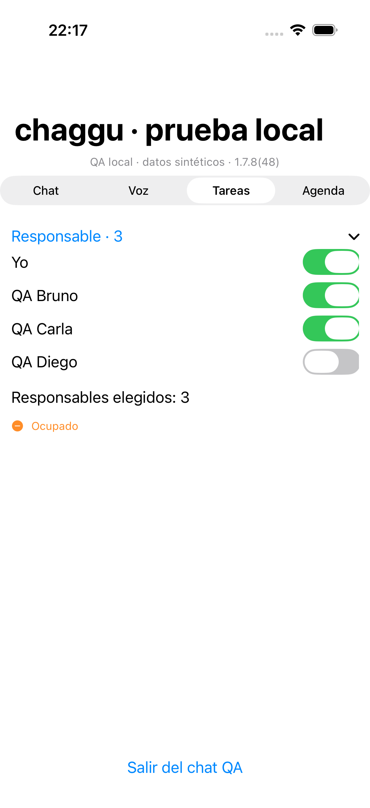
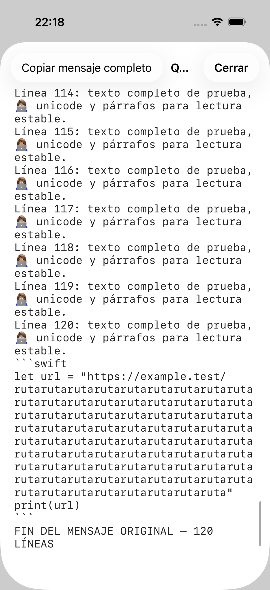
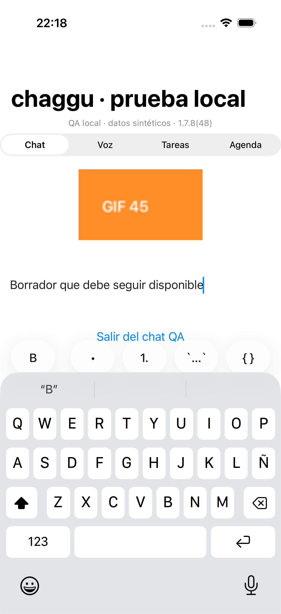
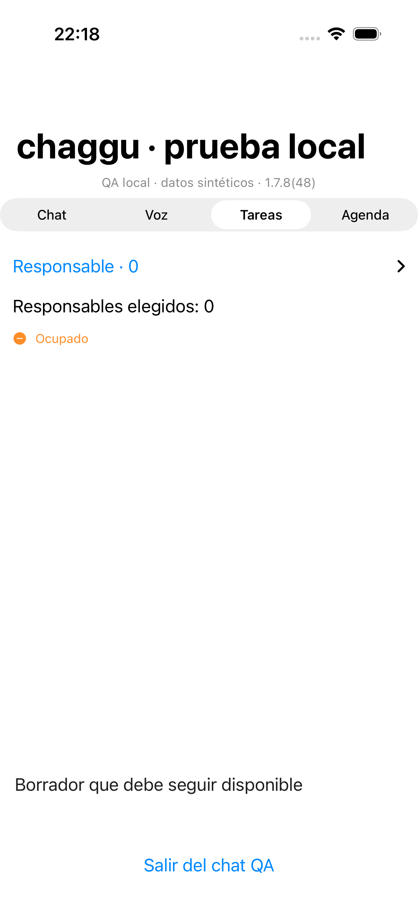

# Tanda nocturna iOS — 1.7.8 (48)

Rama temporal/nocturna-ios-20261001, basada en origin/ios-wa-gg (832ad08). Implementación nativa que conserva la bandeja WhatsApp/gg de 1.7.7(47). Solo TestFlight interno. El número 48 se reservó después de verificar App Store Connect: máximo 47 VALID, pública 1.7.5 y submission vigente WAITING_FOR_REVIEW; grupos Internal y External con cinco testers cada uno. No se modifican la revisión pública, testers ni app_releases.

| Requisitos | Cambio nativo | Evidencia local |
|---|---|---|
| N01/N04 | Selector GIF/meme integrado selectivamente; GIF original animado por frame y duración, MIME normalizado, pausa fuera de pantalla/en segundo plano y reproducción explícita con Reducir movimiento. Decoder hasta 4096 frames, presupuesto 2 Mp de frames decodificados y 300 kp en catálogo/borradores; catálogo a través de API existente. | GifMemeTests; captura y clip de GIF sintético de 260 frames. |
| N02 | Créditos verificados compactos con ficha y enlaces HTTPS; comentario visible/copia/edición usa displayBody ?? body. Solo se oculta body legacy si equivale exactamente a attribution verificada. Memes locales sin procedencia verificada conservan los créditos completos. | NightContractTests; ios-N01-N02-N14-chat.png. |
| N03/N19 | Copiar imagen descarga autenticada y escribe PNG en el portapapeles; Compartir original conserva GIF. Copiar mensaje completo mantiene texto, unicode, saltos y bloques; nunca copia bytes de un adjunto implícitamente. Errores y 403 no muestran éxito. | Pruebas de pasteboard real con texto largo/PNG/403 y copia literal de código. |
| N05 | Cuatro sonidos originales CC0: energy, spark, portal, victory. Catorce opciones de mensaje, tres tonos de llamada conservados. La vista previa no roba la sesión de una llamada activa. | SoundsTests verifica todos los CAF y etiquetas; licencia incluida. |
| N14/N15 | Negrita simple/doble compatible, listas, inline code y fenced code con idioma y Copiar. Código literal sin activación de menciones/enlaces. Parser, imágenes y caches acotados; bloque largo abre lector completo. | MessageFormatTests, NightContractTests, captura de código. |
| N16 | Texto mayor que 8000 UTF-16 exige conversión explícita a .txt UTF-8, hasta 1 MiB, manteniendo original exacto y opción de volver a editar. Se elimina truncado silencioso. Archivos .txt se leen/copian completos. Borradores por servidor/cuenta/chat, protección de datos iOS, sin backup y con generación que descarta escrituras tardías. | Roundtrip exacto unicode/CRLF; stale-save; scope por cuenta. |
| N17 | Pantalla nativa de tareas conserva filtro y agrupación por servidor/cuenta al volver. iOS ofrece lista agrupada; no se traslada el tablero/cuadrícula de desktop. | Scope hash por cuenta; pruebas de agrupación/filtro existentes. |
| N20 | Estado manual disponible/ocupado/concentrado/no molestar/descanso, silenciosos de una hora explícita y fin manual. Ausente no significa online. Respeta DND/sueño legados y vencimiento; icono/ficha visibles solo desde DTO autorizado. | Pruebas de expiración y desconocido, modos informativos/silenciosos. |
| N21 | Un gesto continuo y un intento único: mantener graba, izquierda cancela, arriba bloquea, soltar abre vista previa y Enviar solicita consentimiento IA. Permiso inicial/gesto interrumpido no inicia una grabación tardía. Captura válida por duración real; errores, cancelación y reintento conservan la nota local. Llamada activa impide iniciar/reanudar audio; descarga suspendida vuelve a comprobar intento y sesión antes de tocar AVAudioSession. Al entrar una llamada se detiene playback y la grabación en curso queda en vista previa, sin enviar. Estado escuchado separado por servidor/cuenta. | VoiceRules/V8VoiceNotificationTests; vista previa con WAV sintético. Micrófono físico pendiente. |
| N22 | Media privada del inbox WA usa su ruta autenticada del dueño; foto/PTT compartidos al chat usan chagguAttachments canónicos del destino y reproductores existentes. kind=voice/durationMs no se infiere del texto Foto/Nota de voz. Estado pendiente/fallido/restringido es explícito, reintento del original solo en fuente propia. | Decode del DTO canónico; QA de bytes/ACL/transcodificación pertenece al backend. No se promete recuperar tarjetas legacy sin original. |
| N24 | Pantalla WA independiente ordena fijados y recencia estable, pagina con cursor/hasMore y muestra syncPartial. Guards de sesión/generación y refresh al reconectar. La bandeja WA de Grupos/DMs conserva su orden existente. | WaInboxGgTests preservados; WaRecency pura. |
| N25 | ↑ busca el primer pendiente pertinente del filtro actual, carga páginas contiguas y scroll al ID real con teclado, comprobando visibilidad. ↓ final sigue separado. No mezcla ventanas around distantes ni avanza lectura sobre huecos; revisiones permiten bajar el cursor deliberadamente. HTTP read/unread/read-tree, socket y bootstrap comparten revisión; un ACK atrasado no pisa un cambio nuevo y un servidor legado conserva fallback monotónico/revalidación. | TreeReadTests: varias páginas, huecos, errores, filtros/bloqueos y no ACK al elegir destino. |
| N27 | Selección múltiple real create/edit/reassign/derivadas; payload assigneeIds y reload. Míos/conteo incluyen corresponsables, agrupación por responsable muestra cada asignación. Privacidad de tareas personales y audiencia de derivadas preservadas; no crea chats. | HTTP fixture de tres responsables create/edit/child/reload; selector interactivo. |
| N28/N30 | Header gg sin contador ni polling automático de pendientes. Cerrar/salir limpia selección y citas temporales; conserva historial, cola de acciones autorizadas y borrador del chat. | Código de GgHeaderButton/GgChatSheets; tests previos de gg. |
| N29 | Calendario desde gg: consulta explícita de slots reales del proveedor, checkedAt/zona y horario diario 09–18. Sin conexión/error no inventa slots. Confirmación explícita con idempotencyKey; título/descripción/correos capturados por el usuario; shareToChat=false. | Formulario nativo real offline; contrato API. OAuth/calendario e invitaciones reales pendientes de prueba física/autorizada. |
| N31/N32 | Mensajes históricos largos se pliegan a ocho líneas y abren lector UITextView independiente con cuerpo completo, selección/copiar y scroll estable; no dependen de convertir futuros envíos. Salir, desmontar compositor o cerrar gg resigna teclado/foco y conserva borrador. | 120 líneas + código + URL larga: capturas de inicio/final y teclado abierto/cerrado; NightProofUITests. |

La pequeña referencia con `{name}` ya usa `L("ref.noAccess", ["name": store.refName(id)])` en esta base; no se atribuye el incidente del binario anterior a una causa sin reproducción. Mover a mi lista principal conserva los endpoints/acciones WA-inbox/gg existentes y sus pruebas de PATCH/estado; no se cambian audiencias para simular el movimiento.

Los requisitos de paneles, rail, drag y cuadriculado de web/EXE/DMG (N06–N12/N18/N23/N26) se implementan en sus clientes y no se fuerzan como una arquitectura nueva de iOS. La corrección de varios invitados de N13 corresponde al contrato API; iOS conserva Chime y añade protección de la sesión de audio de llamadas frente a notas/vistas previas.

## Pruebas y capturas

Suite completa final: 633 tests, 38 omitidos por fixtures/dispositivo no configurado, cero fallos (595 ejecutados). Las omisiones no son evidencia de aceptación física. UI final de 1.7.8(48): cuatro tests ejecutados, cero fallos; selección real de tres switches, lector completo, teclado y formularios voz/calendario. Contratos/GIF: 23 tests, cero fallos. Correcciones posteriores de carreras: 34 tests dirigidos, cero fallos, incluidas respuestas HTTP retenidas y descarga de voz retenida mientras inicia llamada. Suite completa posterior a esas correcciones pasó. Prueba adicional del evento de mensaje propio frente a un ACK atrasado: un test ejecutado, cero fallos; read.updated con revisión 12 llega antes de message.created y el ACK con revisión 11 no baja el cursor. Fixtures offline DEBUG usan únicamente localhost/datos sintéticos y nunca arrancan sesión del usuario; no están presentes en Release.

[Clip GIF animado, 17.8 s](../evidence/nocturna-20261001/ios-N01-gif-animado.mp4) — frames capturados 210 y 135, revisados visualmente.

Capturas son simulador iOS 26.1 con componentes de producción y etiquetas QA local/datos sintéticos. El test de teclado utiliza el compositor real; no acredita todos los caminos de swipe/back/cambio de cuenta en un iPhone físico. PNG en pasteboard y texto se prueban en proceso iOS, sin destinatarios reales.

## Distribución y límites

ExportOptions.internal.plist fija testFlightInternalTestingOnly=true para impedir distribuir este artefacto por TestFlight externo o App Store. Archive/IPA/hash/recibos sanitizados y estado posterior se guardan en release-assets/1.7.8/ios fuera del Git. El snapshot anterior con relaciones de testers es privado; nunca se incluyen credenciales o nombres/correos de testers en documentación.

Aún no se acredita instalación/recepción en iPhone físico, APNs, micrófono/interrupción real, codecs OGG/Opus de dispositivos, llamada Chime con varios invitados, ni un calendario OAuth del usuario. Se mantiene el error real del reproductor; no se convierte cualquier extensión .ogg en una promesa de compatibilidad. El backend puede ofrecer una variante AAC estándar por su pipeline.

Generación de traducciones usa WEB_I18N de la tanda web actual para conservar la terminología Tareas y las claves nativas ya presentes en la base iOS. No se regenera contra el web más antiguo incluido en esta rama.
